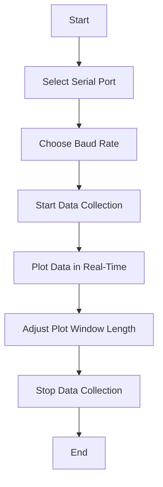
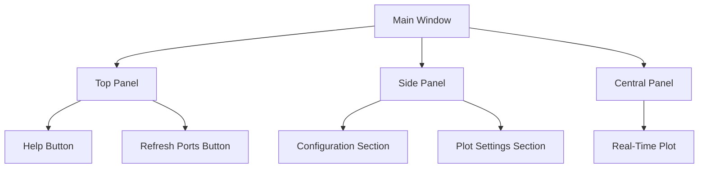

# Plottypus

Plottypus is a serial data plotter application written in Rust. It provides a graphical user interface (GUI) for selecting serial ports, baud rates, and starting/stopping data collection. The application plots the collected data in real-time and includes a help window with basic usage instructions.

## Features

- Select serial ports and baud rates
- Start and stop data collection
- Real-time data plotting
- Adjustable plot window length
- Help window with usage instructions

## Dependencies

The application uses the following crates:

- `eframe` for the GUI framework
- `egui` for the GUI components
- `serialport` for serial communication
- `webbrowser` for opening web links

## Installation

To install and run the application, follow these steps:

1. Ensure you have Rust installed. If not, install it from [rust-lang.org](https://www.rust-lang.org/).
2. Clone the repository:
   ```sh
   git clone https://github.com/CLoaKY233/Plottypus.git
   ```
3. Navigate to the project directory:
   ```sh
   cd Plottypus
   ```
4. Build and run the application:
   ```sh
   cargo run
   ```

## Usage

1. Select your serial port from the dropdown menu.
2. Choose the appropriate baud rate.
3. Click 'Start' to begin data collection.
4. Adjust the window length to change the visible time range.

## Diagrams

### Application Workflow



### GUI Layout



## Help

For more information, visit [www.cloakycodes.me](https://www.cloakycodes.me).
